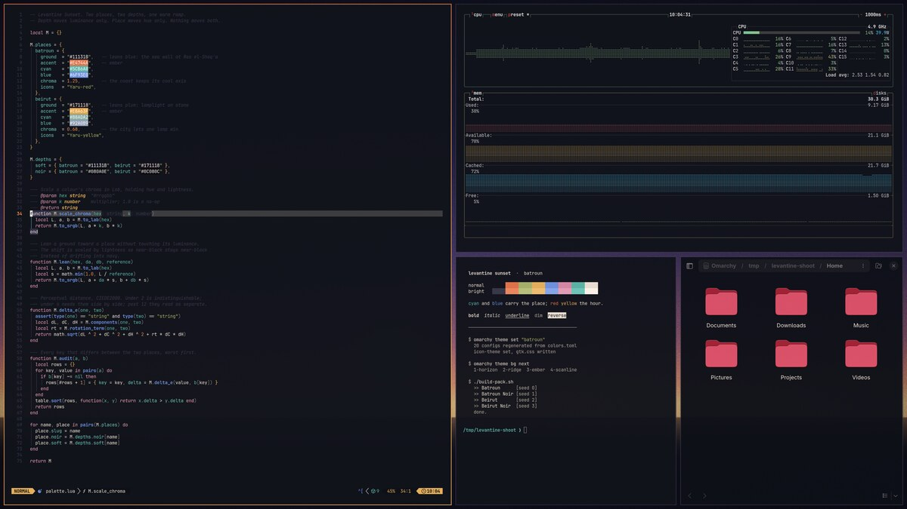
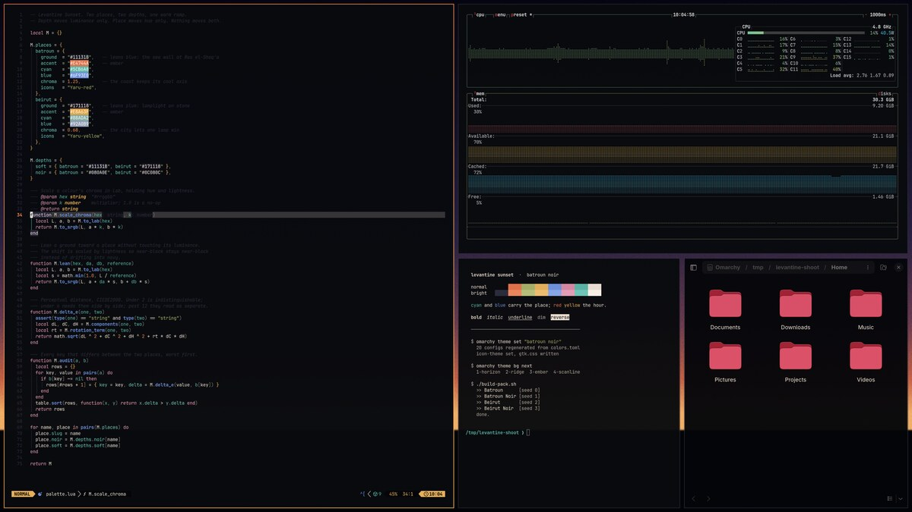
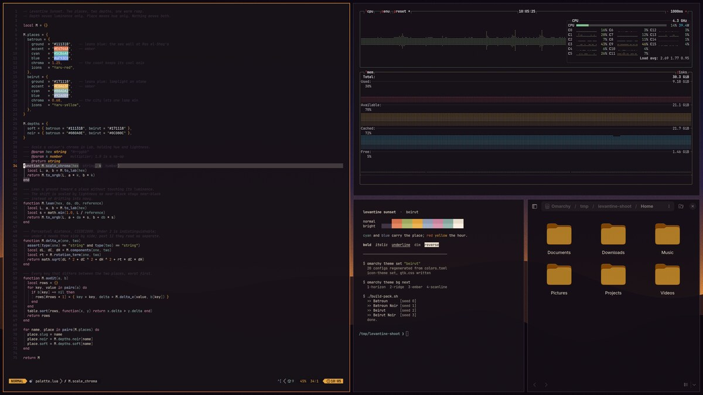
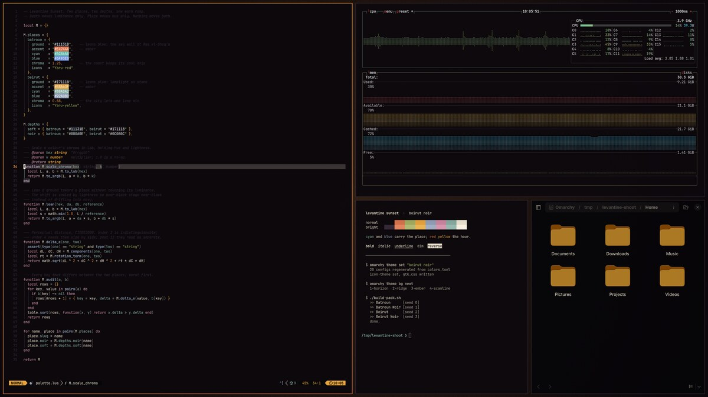

# Levantine Sunset

Four Omarchy themes: two places, each at two depths.

**Batroun** is the coast; the Phoenician sea wall, sun going down over the water.
**Beirut** is the city after dark; warm lamplight on stone. Each comes in a soft
indigo depth and a near-black *Noir*.

Omarchy installs one theme per repository, so each of the four has its own; this
repo is the collection and the generator that builds them.

| | |
|---|---|
| [](https://github.com/gaius-codius/omarchy-batroun-theme) | **[Batroun](https://github.com/gaius-codius/omarchy-batroun-theme)**<br>The coast. The Phoenician sea wall at Ras el-Shaq’a, sun going down over the water.<br>`omarchy theme install https://github.com/gaius-codius/omarchy-batroun-theme` |
| [](https://github.com/gaius-codius/omarchy-batroun-noir-theme) | **[Batroun Noir](https://github.com/gaius-codius/omarchy-batroun-noir-theme)**<br>Batroun with the lights out. The same ember and gold on near-black.<br>`omarchy theme install https://github.com/gaius-codius/omarchy-batroun-noir-theme` |
| [](https://github.com/gaius-codius/omarchy-beirut-theme) | **[Beirut](https://github.com/gaius-codius/omarchy-beirut-theme)**<br>The city after dark. Warm lamplight on stone.<br>`omarchy theme install https://github.com/gaius-codius/omarchy-beirut-theme` |
| [](https://github.com/gaius-codius/omarchy-beirut-noir-theme) | **[Beirut Noir](https://github.com/gaius-codius/omarchy-beirut-noir-theme)**<br>Beirut at the far end of the evening. The same clay and amber on near-black.<br>`omarchy theme install https://github.com/gaius-codius/omarchy-beirut-noir-theme` |

## The two axes

Depth moves **luminance** only. Place moves **hue** only. Nothing moves both, so the
two are independent: both depths of a place share every accent, and both places at a
depth share the same luminance on every key.

| theme | accent | ground | cyan | blue | icons |
|---|---|---|---|---|---|
| Batroun | `#E4744A` | `#11131B` | `#5CB6A8` | `#6F93E0` | `Yaru-red` |
| Batroun Noir | `#E4744A` | `#080A0E` | `#5CB6A8` | `#6F93E0` | `Yaru-red` |
| Beirut | `#E8A63F` | `#171118` | `#88ADA2` | `#92A0B9` | `Yaru-yellow` |
| Beirut Noir | `#E8A63F` | `#0C080C` | `#88ADA2` | `#92A0B9` | `Yaru-yellow` |

Batroun's ground leans blue and holds a present cyan and blue, because it is a coast.
Beirut's leans plum and pushes both toward grey, so nothing competes with the amber and
the screen reads as lit by one lamp. The cool keys are scaled ×1.25 and ×0.68 in Lab —
chroma only, hue and lightness held, so syntax highlighting keeps its relationships.

## Wallpapers

Four per theme, generated procedurally from each theme's own hex values — no source
photographs. `SEED` varies them per theme, so no two draw the same frame.

| file | | luminance (soft / noir) |
|---|---|---|
| `1-colonnade` | pointed arches cut from a dark wall, evening beyond | 40–45 / 32–38 |
| `2-ridge` | two rolling silhouettes against a horizon | 31–33 / 28–31 |
| `3-shaft` | one warm beam falling through the dark | 24–25 / 17 |
| `4-scanline` | a horizon on a CRT, every third row dimmed | 51–53 / 48–51 |

The arcade in `1-colonnade` is the same one on the Plymouth boot mark — pointed rather
than Roman, each arch two arcs of radius 1.5× the half-span so they meet at a point.

## Building

`build-pack.sh` regenerates all four themes and every wallpaper into
`~/.config/omarchy/themes/`.

```sh
./build-pack.sh                  # 3840x2160, ~4 min
W=1280 H=720 ./build-pack.sh     # fast preview build
DEST=/tmp/try ./build-pack.sh    # somewhere other than the live themes
ASSETS_ONLY=1 ./build-pack.sh    # colours and logos only, skip wallpapers
```

Palettes are the `p_batroun` / `p_beirut` functions, depths `d_soft` / `d_black`.
Change a hex, re-run, then `omarchy theme set "Beirut"`.

`candidates/` holds two wallpapers that were rendered and not used — a mashrabiya
lattice and a plaster wash — if the set ever wants a fifth.

## Optional: matching file-manager colours

`omarchy theme set` does touch GTK — `omarchy-theme-set-gnome` sets `color-scheme`,
`gtk-theme` and `icon-theme` on every switch — but `gtk-theme` is only ever
`Adwaita` or `Adwaita-dark`, so a theme's *colours* never reach GTK and every dark
theme yields an identical Nautilus. This theme ships an `icons.theme` so at least
the folder icons match its accent, which is the documented mechanism and travels
with the theme.

Carrying the actual colours needs a machine-level template, because there is no
sanctioned way to ship one inside a theme. It applies to **every** installed theme,
stock ones included — which is why it isn't in this repo:

    ~/.config/omarchy/themed/gtk.css.tpl        # the template
    ~/.config/gtk-4.0/gtk.css -> ~/.local/state/omarchy/current/theme/gtk.css

`omarchy-theme-set-templates` globs `~/.config/omarchy/themed/*.tpl`, so adding a
template makes every theme generate a `gtk.css` alongside its `ghostty.conf`; the
symlink points GTK at whichever theme is active. GTK reads its CSS at startup, so
restart an app to see a change (`nautilus -q`, then reopen). The template is in the
[collection repo](https://github.com/gaius-codius/levantine-sunset).

## Licence

MIT. See [LICENSE](LICENSE).
